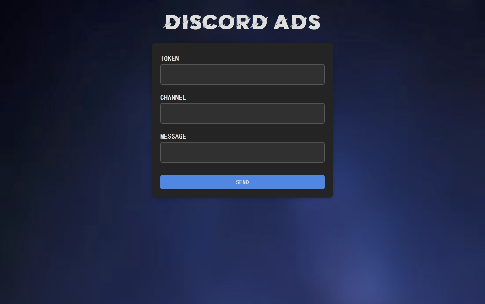

# Discord ADS Tool

**Discord ADS Tool** allows you to send messages to specific channels using Discord tokens. This tool supports sending messages to multiple channels simultaneously by utilizing multiple tokens, providing flexibility and efficiency for your messaging needs.

## Features

- **Multiple Token Support**: Utilize multiple Discord tokens to send messages to various channels.
- **Targeted Messaging**: Directly send messages to specific channels of your choice.
- **User-Friendly Interface**: Simple web interface for easy management and operation.

## Screenshot

## Website

You can access the tool and get started here: [Discord ADS Tool Website](https://discordads.netlify.app/)
